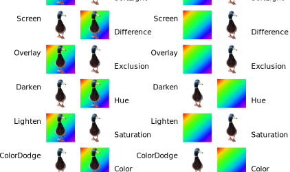
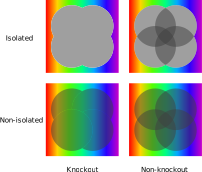
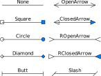
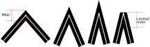

# Glossary

Alpha

Opacity
: Alpha values are real numbers in the closed interval from 0 to 1,
  where 0 means full transparency, and 1 means full opacity.

Annotation Type
: There are many annotation types defined in the PDF reference.
   
  MuPDF supports the following types:
  : Text, FreeText, Square, Circle, Line, Polygon,
    PolyLine, Highlight, Underline, Squiggly, StrikeOut,
    Redact, Stamp, Caret, Ink, Popup, FileAttachment,
    Redaction
   
  These types are not supported yet:
  : Sound, Movie, RichMedia, Widget, Screen, PrinterMark,
    TrapNet, Watermark, 3D, Projection

Associated File
: TODO

Blend Mode
: Blend modes define how a layer of graphics combines with a backdrop.
   
  Below is an illustration of the visual effect for RGB colors for the blend
  modes defined for PDF.
   
  For further details refer to the PDF specification’s [section
  on blend modes](https://opensource.adobe.com/dc-acrobat-sdk-docs/pdfstandards/pdfreference1.7old.pdf#G12.12449365).
   
  

Border Effect
: Fancier borders can be drawn with a border effect:
  : None, Cloudy

Border Style
: Annotations have have two border styles:
  : Solid, Dashed
   
  More fancy borders are defined by the [border effect](#term-Border-Effect).

CMYK JPEG
: The situation with JPEG and CMYK colorspaces is complicated, and depends on
  many factors such as App markers, the ColorTransform PDF parameter, and whether
  a JPEG is intended as a standalone or embedded in PDF.
   
  TODO: explain our behavior, and adobe’s behavior, and when impossible situations appear

File specification
: In PDF a file specification names a file.
   
  If a file specification only contains a file name or a path,
  then it represents an external file. Such a file is assumed
  to be found at the specified location in the file system.
   
  A file specification may also embed the file contents as a
  stream inside the PDF. In this case the file specification
  represents an embedded file. For embedded files, further
  metadata may be stored (e.g. file size, creation and
  modification date).
   
  For more details read the PDF specification’s section on
  [file specifications](https://opensource.adobe.com/dc-acrobat-sdk-docs/pdfstandards/pdfreference1.7old.pdf#G8.1640832).

Icon Name
: Some annotations appear as an icon.
  The available icons differ per annotation type.
   
  Text
  : Comment,
    Help,
    Insert,
    Key,
    NewParagraph,
    Note,
    Paragraph
   
  FileAttachment
  : Graph,
    PaperClip,
    PushPin,
    Tag
   
  Sound
  : Mic,
    Speaker
   
  Stamp
  : Approved,
    AsIs,
    Confidential,
    Departmental,
    Draft,
    Experimental,
    Expired,
    Final,
    ForComment,
    ForPublicRelease,
    NotApproved,
    NotForPublicRelease,
    Sold,
    TopSecret

Knockout and Isolation
: In a knockout transparency group each element overwrites the prior
  elements in the group instead of compositing with them.
   
  In an isolated transparency group the group does not composite with
  the group’s backdrop, but rather a fully transparent backdrop.
   
  For further details refer to the PDF specification’s sections on
  [isolation](https://opensource.adobe.com/dc-acrobat-sdk-docs/pdfstandards/pdfreference1.7old.pdf#G12.1689467)
  and
  [knockout](https://opensource.adobe.com/dc-acrobat-sdk-docs/pdfstandards/pdfreference1.7old.pdf#G12.1689478).
   
  

Language code
: Language codes consists of a primary code, followed
  zero or more by subcodes each preceded by a hyphen,
  e.g. “en”, “en-US”, “kr”, “zh-CN”, “zh-TW”.
   
  For further details see the PDF specification’s section
  on [Language Identifiers](https://opensource.adobe.com/dc-acrobat-sdk-docs/pdfstandards/pdfreference1.7old.pdf#G15.2262093).

Line Cap Style
: PDFs define three different shapes for the ends of unclosed subpaths:
  butt cap, round cap, and square cap. See below for the visual effect and
  refer to the PDF specifications section about [Line Cap Styles](https://opensource.adobe.com/dc-acrobat-sdk-docs/pdfstandards/pdfreference1.7old.pdf#G9.1849678)
  for details.
   
  

Line Ending Style
: Styles used to draw line endings for certain annotations.
  Below is an illustration with the name of each style.
  The example uses black line color, with both none and
  blue interior color.
   
  

Line Join Style
: PDFs define three different shapes for the joining of two lines in a
  subpath: miter join, round join, and bevel join. See below for the
  visual effects and refer to the PDF specifications section about [Line
  Join Styles](https://opensource.adobe.com/dc-acrobat-sdk-docs/pdfstandards/pdfreference1.7old.pdf#G9.1849699)
  for details.
   
  

MIME-type
: A MIME-type is a string describing the type of data.
  PDF data has the MIME-type “application/pdf”, while
  unknown data has the MIME-type
  “application/octet-stream”. For further details see the
  specification that the PDF specification references:
  [RFC 2048 - Multipurpose Internet Mail Extensions
  (MIME) Part Two: Media Types](https://www.rfc-editor.org/info/rfc2048).

Miter Limit
: When mitered line joins are used, then lines joining at sharper and
  sharper angles will produce longer and longer miters. The miter may stick
  out longer than anticipated. Therefore PDF defines a miter limit value,
  at which a longer miter join will be changed to a bevel join. See below
  for the visual effects and refer to the PDF specifications section about
  [Miter Limit](https://opensource.adobe.com/dc-acrobat-sdk-docs/pdfstandards/pdfreference1.7old.pdf#G9.3859627)
  for details.
   
  

Page Box
: The PDF reference defines several boxes to determine different parts
  of a page. See the chapter on
  [Page Boundaries](https://opensource.adobe.com/dc-acrobat-sdk-docs/pdfstandards/pdfreference1.7old.pdf#G15.2260711)
  for more details.
   
  MediaBox
  : The MediaBox defines the size of the physical medium on
    which the page is to be printed. It includes items that
    will be physically trimmed from the final product like
    crop marks, registration marks, etc.
   
  CropBox
  : The CropBox defines the visible region of the page to
    be displayed or printed. This has no real meaning, but
    is used to clip the page contents when rendering.
   
  BleedBox
  : The BleedBox defines the region to which the page
    contents expect to be clipped. This includes any extra
    bleed area to account for imprecision in the printing
    process.
   
  TrimBox
  : The TrimBox defines the intended dimensions of the
    finished page after trimming.
   
  ArtBox
  : The ArtBox defines the area where it is considered safe
    to place graphical elements.

QuadPoint
: A QuadPoint in PDF is a non-axis aligned quadrilateral, used to define
  areas on the page that typically cover text (which may be rotated, or
  skewed). It is given as an array of 8 numbers (four x, y pairs).
   
  QuadPoints are used with Link and text markup annotations.
   
  The order of the points is a matter of confusion, because the order
  used in the PDF reference doesn’t match the order that Adobe uses.
   
  This is the order that is typically used:
  : `[ ulx uly urx ury llx lly lrx lry ]`

Standard Structure Type
: The PDF specification defines how a PDF can specify a logical structure
  hierarchy of elements, similar to of HTML or XML. Each of the
  [defined structure elements](https://opensource.adobe.com/dc-acrobat-sdk-docs/pdfstandards/pdfreference1.7old.pdf#G15.2259688),
  e.g. Div, BlockQuote, P, H1-H6 etc., are associated with some visual
  content.

Widget Type
: Widgets are a type of annotation.
  There are a few different subtypes:
   
  Btn
  : Pushbutton, Check Boxes, Radio Buttons
   
  Tx
  : Text Fields
   
  Ch
  : Choice Fields (list box, combo box)
   
  Sig
  : Signature Field

Winding

Non-zero Winding Number Rule

Even-Odd Rule
: These rules in PDF defined what parts of a [`Path`](../javascript/types/Path.md#Path) are inside and
  outside the curve respectively. This is used to determine what parts
  of a curve should be filled.
   
  See the PDF specification sections on the
  [Non-zero Winding Number Rule](https://opensource.adobe.com/dc-acrobat-sdk-docs/pdfstandards/pdfreference1.7old.pdf#G9.1850134)
  and
  [Even-Odd Rule](https://opensource.adobe.com/dc-acrobat-sdk-docs/pdfstandards/pdfreference1.7old.pdf#G9.1850155).
