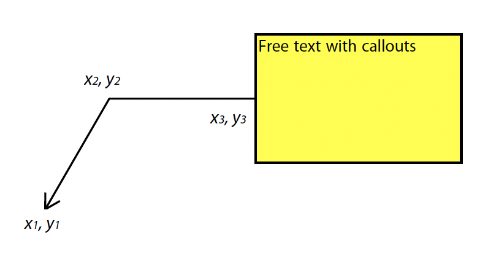
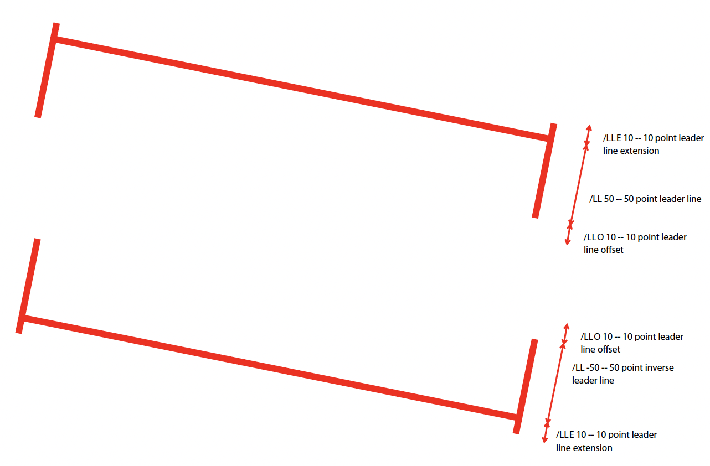
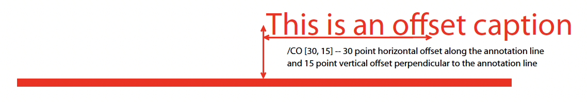

# PDFAnnotation

PDF Annotations belong to a specific [PDFPage](PDFPage.md) and may be
created/changed/removed. Because annotation appearances may change (for several
reasons) it is possible to scan through the annotations on a page and query
them to see whether a re-render is necessary.

Additionally redaction annotations can be applied to a [PDFPage](PDFPage.md),
destructively removing content from the page.

## Annotation Types

These are the annotation types, and which attributes they have.

Text
: An icon with a popup of text.
  <br/>
  Set the appearance with the Icon attribute.
  <br/>
  Attributes: [Rect](), [Color](#color-attribute), [Icon](#icon-attribute).

FreeText
: Text in a rectangle on the page.
  <br/>
  The text font and color is defined by DefaultAppearance.
  <br/>
  Attributes: [Border](#border-attribute), [Rect](#rect-attribute), [Default Appearance](#default-appearance-attribute).

Line
: A line with optional arrow heads.
  <br/>
  The line width is determined by the border attribute.
  <br/>
  The end points are defined by the Line attribute.
  <br/>
  Attributes: [Border](#border-attribute), [Color](#color-attribute), [Line](#line-attribute), [Line Ending Styles](#line-ending-styles-attribute).

Square
: A rectangle.
  <br/>
  Attributes: [Rect](#rect-attribute), [Rect](#rect-attribute), [Color](#color-attribute), [Interior Color](#interior-color-attribute).

Circle
: An ellipse.
  <br/>
  Attributes: [Rect](#rect-attribute), [Border](#border-attribute), [Color](#color-attribute), [Interior Color](#interior-color-attribute).

Polygon, PolyLine
: A polygon shape (closed and open).
  <br/>
  The shape is defined by the Vertices attribute.
  <br/>
  The line width is defined by the Border attribute.
  <br/>
  Attributes: [Vertices](#vertices-attribute), [Border](#border-attribute), [Color](#color-attribute), [Interior Color](#interior-color-attribute), LineEndingStyles.

Highlight, Underline, Squiggly, StrikeOut
: Text markups.
  <br/>
  The shape is defined by the [QuadPoints](#quadpoints-attribute).

Stamp
: A rubber stamp.
  <br/>
  The appearance is either a stock name, or a [custom image](#stamp-image-attribute).

Ink
: A free-hand line.
  <br/>
  The shape is defined by the [Ink List](#inklist-attribute) attribute.

FileAttachment
: A file attachment.
  <br/>
  The appearance is an icon on the page.
  <br/>
  Set the attached file contents with the [Filespec](#filespec-attribute) attribute,
  and the appearance with the [Icon](#icon-attribute) attribute.

Redaction
: A black box.
  <br/>
  Redaction annotations are used to mark areas of the page that
  can be redacted. They do NOT redact any content by themselves,
  you MUST apply them using [`PDFAnnotation.prototype.applyRedaction`](#PDFAnnotation.prototype.applyRedaction) or
  [`PDFPage.prototype.applyRedactions`](PDFPage.md#PDFPage.prototype.applyRedactions).

These annotation types are special and handled with other APIs:

- [Link](Link.md)
- Popup – see [`PDFAnnotation.prototype.setPopup()`](#PDFAnnotation.prototype.setPopup)
- Widget – see [PDFWidget](PDFWidget.md)

## Constructors

### *class* PDFAnnotation()

*You cannot create instances of this class with the new operator!*

To get the annotations on a page use [`PDFPage.prototype.getAnnotations()`](PDFPage.md#PDFPage.prototype.getAnnotations).

To create a new annotation call [`PDFPage.prototype.createAnnotation()`](PDFPage.md#PDFPage.prototype.createAnnotation).

## Instance methods

### PDFAnnotation.prototype.getBounds()

Returns a rectangle containing the location and dimension of the annotation.

* **Returns:**
  [Rect](Rect.md)

```javascript
var bounds = annotation.getBounds()
```

### PDFAnnotation.prototype.run(device, matrix)

Calls the device functions to draw the annotation.

* **Arguments:**
  * **device** ([`Device`](Device.md#Device)) – The device to make device calls to while rendering the annotation.
  * **matrix** ([`Matrix`](Matrix.md#Matrix)) – The transformation matrix.

```javascript
annotation.run(device, mupdf.Matrix.identity)
```

### PDFAnnotation.prototype.toPixmap(matrix, colorspace, alpha)

Render the annotation into a [Pixmap](Pixmap.md), using the
`transform`, `colorspace` and `alpha` parameters.

* **Arguments:**
  * **matrix** ([`Matrix`](Matrix.md#Matrix)) – Transformation matrix.
  * **colorspace** ([`ColorSpace`](ColorSpace.md#ColorSpace)) – The desired colorspace of the returned pixmap.
  * **alpha** (`boolean`) – Whether the returned pixmap has transparency or not. If the pixmap handles transparency, it starts out transparent (otherwise it is filled white), before the contents of the display list are rendered onto the pixmap.
* **Returns:**
  [Pixmap](Pixmap.md)

```javascript
var pixmap = annotation.toPixmap(mupdf.Matrix.identity, mupdf.ColorSpace.DeviceRGB, true)
```

### PDFAnnotation.prototype.toDisplayList()

Record the contents of the annotation into a [DisplayList](DisplayList.md).

* **Returns:**
  [DisplayList](DisplayList.md)

```javascript
var displayList = annotation.toDisplayList()
```

### PDFAnnotation.prototype.getObject()

Get the underlying [PDFObject](PDFObject.md) for an annotation.

* **Returns:**
  [PDFObject](PDFObject.md)

```javascript
var obj = annotation.getObject()
```

### PDFAnnotation.prototype.setAppearance(appearance, state, transform, bbox, resources, contents)

Set the annotation appearance stream for the given appearance. The
desired appearance is given as a transform along with a bounding box, a
PDF dictionary of resources and a content stream.

* **Arguments:**
  * **appearance** (`string | null`) – Appearance stream (“N” for normal, “R” for roll-over or “D” for down). Defaults to “N”.
  * **state** (`string | null`) – The annotation state to set the appearance for or null for the current state. Only widget annotations of pushbutton, check box, or radio button type have states, which are “Off” or “Yes”. For other types of annotations pass null.
  * **transform** ([`Matrix`](Matrix.md#Matrix)) – The transformation matrix.
  * **bbox** ([`Rect`](Rect.md#Rect)) – The bounding box.,
  * **resources** ([`PDFObject`](PDFObject.md#PDFObject)) – Resources object.
  * **contents** (`Buffer | ArrayBuffer | Uint8Array | string`) – Contents string.

```javascript
annotation.setAppearance(
        "N",
        null,
        mupdf.Matrix.identity,
        [0, 0, 100, 100],
        resources,
        contents
)
```

### PDFAnnotation.prototype.update()

Update the appearance stream to account for changes in the annotation.

Returns true if the annotation appearance changed during the call.

* **Returns:**
  boolean

```javascript
annotation.update()
```

### PDFAnnotation.prototype.setAppearanceFromDisplayList(appearance, state, transform, list)

Set the annotation appearance stream for the given appearance. The
desired appearance is given as a transform along with a display list.

* **Arguments:**
  * **appearance** (`string`) – Appearance stream (“N”, “R” or “D”).
  * **state** (`string`) – The annotation state to set the appearance for or null for the current state. Only widget annotations of pushbutton, check box, or radio button type have states, which are “Off” or “Yes”. For other types of annotations pass null.
  * **transform** ([`Matrix`](Matrix.md#Matrix)) – The transformation matrix.
  * **list** ([`DisplayList`](DisplayList.md#DisplayList)) – The display list.

```javascript
annotation.setAppearanceFromDisplayList(
        "N",
        null,
        mupdf.Matrix.identity,
        displayList
)
```

### PDFAnnotation.prototype.getHiddenForEditing()

Get a special annotation hidden flag for editing. This flag prevents the annotation from being rendered.

* **Returns:**
  boolean

```javascript
var hidden = annotation.getHiddenForEditing()
```

### PDFAnnotation.prototype.setHiddenForEditing(hidden)

Set a special annotation hidden flag for editing. This flag prevents the annotation from being rendered.

* **Arguments:**
  * **hidden** (`boolean`)

```javascript
annotation.setHiddenForEditing(true)
```

### PDFAnnotation.prototype.getHot()

<span class="only_mutool">only&nbsp;mutool&nbsp;run</span>

Check if the annotation is hot, i.e. that the pointing device’s cursor
is hovering over the annotation.

* **Returns:**
  boolean

```javascript
annotation.getHot()
```

### PDFAnnotation.prototype.setHot(hot)

<span class="only_mutool">only&nbsp;mutool&nbsp;run</span>

Set the annotation as being hot, i.e. that the pointing device’s cursor
is hovering over the annotation.

* **Arguments:**
  * **hot** (`boolean`)

```javascript
annotation.setHot(true)
```

### PDFAnnotation.prototype.requestSynthesis()

<span class="only_mutool">only&nbsp;mutool&nbsp;run</span>

Request that if an annotation does not have an appearance stream, flag
the annotation to have one generated. The appearance stream
will be created during future calls to
[`PDFAnnotation.prototype.update()`](#PDFAnnotation.prototype.update) on or
[`PDFPage.prototype.update()`](PDFPage.md#PDFPage.prototype.update).

```javascript
annotation.requestSynthesis()
```

### PDFAnnotation.prototype.requestResynthesis()

<span class="only_mutool">only&nbsp;mutool&nbsp;run</span>

Request that an appearance stream shall be re-generated for an
annotation next time update() is called on
[`PDFAnnotation.prototype.update()`](#PDFAnnotation.prototype.update) or
[`PDFPage.prototype.update()`](PDFPage.md#PDFPage.prototype.update).

This is a side-effect of setting annotation attributes through
the PDFAnnotation interface, so normally this call does not
need to be done explicitly.

```javascript
annotation.requestResynthesis()
```

### PDFAnnotation.prototype.process(processor)

<span class="only_mutool">only&nbsp;mutool&nbsp;run</span>

Run through the annotation appearance stream and call methods
on the supplied [PDFProcessor](PDFProcessor.md).

* **Arguments:**
  * **processor** ([`PDFProcessor`](PDFProcessor.md#PDFProcessor)) – User defined function.

```javascript
annotation.process(processor)
```

### PDFAnnotation.prototype.applyRedaction(blackBoxes, imageMethod, lineArtMethod, textMethod)

Applies a single Redaction annotation.

See [`PDFPage.prototype.applyRedactions`](PDFPage.md#PDFPage.prototype.applyRedactions) for details.

## Annotation attributes

PDF Annotations have many attributes. Some of these are common to all
annotations, and some only exist on specific annotation types.

### Common

### PDFAnnotation.prototype.getType()

Return the [annotation type](../../common/glossary.md#term-Annotation-Type) for this annotation.

* **Returns:**
  string

```javascript
var type = annotation.getType()
```

### PDFAnnotation.prototype.getFlags()

Get the annotation flags.

See [`PDFAnnotation.prototype.setFlags`](#PDFAnnotation.prototype.setFlags).

* **Returns:**
  number

```javascript
var flags = annotation.getFlags()
```

### PDFAnnotation.prototype.setFlags(flags)

Set the annotation flags.

* **Arguments:**
  * **flags** (`number`) – A bit mask with the flags (see below).

|   Bit | Name           |
|-------|----------------|
|     1 | Invisible      |
|     2 | Hidden         |
|     3 | Print          |
|     4 | NoZoom         |
|     5 | NoRotate       |
|     6 | NoView         |
|     7 | ReadOnly       |
|     8 | Locked         |
|     9 | ToggleNoView   |
|    10 | LockedContents |
```javascript
annotation.setFlags(4) // Clears all other flags and sets "NoZoom".
```

### PDFAnnotation.prototype.getContents()

Get the annotation contents.

* **Returns:**
  string

```javascript
var contents = annotation.getContents()
```

### PDFAnnotation.prototype.setContents(text)

Set the annotation contents.

* **Arguments:**
  * **text** (`string`)

```javascript
annotation.setContents("Hello World")
```

### PDFAnnotation.prototype.getCreationDate()

Get the annotation creation date as a Date object.

* **Returns:**
  Date

```javascript
var date = annotation.getCreationDate()
```

### PDFAnnotation.prototype.setCreationDate(date)

Set the creation date.

* **Arguments:**
  * **date** (`Date`) – A Date object.

```javascript
annotation.setCreationDate(new Date())
```

### PDFAnnotation.prototype.getModificationDate()

Get the annotation modification date as a Date object.

* **Returns:**
  Date

```javascript
var date = annotation.getModificationDate()
```

### PDFAnnotation.prototype.setModificationDate(date)

Set the modification date.

* **Arguments:**
  * **date** (`Date`)

```javascript
annotation.setModificationDate(new Date())
```

### PDFAnnotation.prototype.getLanguage()

Get the annotation [language code](../../common/glossary.md#term-Language-code) (or get the one
inherited from the document).

* **Returns:**
  string | null

```javascript
var language = annotation.getLanguage()
```

### PDFAnnotation.prototype.setLanguage(language)

Set the annotation [language code](../../common/glossary.md#term-Language-code).

* **Arguments:**
  * **language** (`string`) – The desired language code.

```javascript
annotation.setLanguage("en")
```

<a id="rect-attribute"></a>

### Rect

For annotations that can be resized by setting its bounding box rectangle
(e.g. Square and FreeText), [`PDFAnnotation.prototype.hasRect()`](#PDFAnnotation.prototype.hasRect) returns `true`.

Other annotation types, (e.g. Line, Polygon, and InkList)
change size by adding/removing vertices.
Yet other annotations (e.g. Highlight and StrikeOut)
change size by adding/removing QuadPoints.

The underlying Rect attribute on the PDF object is automatically updated as needed
for these other annotation types.

### PDFAnnotation.prototype.hasRect()

Checks whether the annotation can be resized by setting its
bounding box.

* **Returns:**
  boolean

```javascript
var hasRect = annotation.hasRect()
```

### PDFAnnotation.prototype.getRect()

Get the annotation bounding box.

* **Returns:**
  [Rect](Rect.md)

```javascript
var rect = annotation.getRect()
```

### PDFAnnotation.prototype.setRect(rect)

Set the annotation bounding box.

* **Arguments:**
  * **rect** ([`Rect`](Rect.md#Rect)) – The new desired bounding box.

```javascript
annotation.setRect([0, 0, 100, 100])
```

<a id="rich-contents-attribute"></a>

### Rich contents

### PDFAnnotation.prototype.hasRichContents()

Returns whether the annotation is capable of supporting rich text
contents.

* **Returns:**
  boolean

```javascript
var hasRichContents = annotation.hasRichContents()
```

### PDFAnnotation.prototype.getRichContents()

Obtain the annotation’s rich-text contents, as opposed to the plain
text contents obtained by [`getContents()`](#PDFAnnotation.prototype.getContents).

* **Returns:**
  string

```javascript
var richContents = annotation.getRichContents()
```

### PDFAnnotation.prototype.setRichContents(plainText, richText)

Set the annotation’s rich-text contents, as opposed to the plain
text contents set by [`setContents()`](#PDFAnnotation.prototype.setContents).

* **Arguments:**
  * **plainText** (`string`)
  * **richText** (`string`)

```javascript
annotation.setRichContents("plain text", "<b><i>Rich-Text</i></b>")
```

### PDFAnnotation.prototype.getRichDefaults()

Get the default style used for the annotation’s rich-text contents.

* **Returns:**
  string

```javascript
var richDefaults = annotation.getRichDefaults()
```

### PDFAnnotation.prototype.setRichDefaults(style)

Set the default style used for the annotation’s rich-text contents.

* **Arguments:**
  * **style** (`string`)

```javascript
annotation.setRichDefaults("font-size: 16pt")
```

<a id="color-attribute"></a>

### Color

The meaning of the color attribute depends on the annotation type. For some it is the color
of the border.

### PDFAnnotation.prototype.getColor()

Get the annotation color, represented as an array of 0, 1, 3, or 4 component values.

* **Returns:**
  [Color](Color.md)

```javascript
var color = annotation.getColor()
```

### PDFAnnotation.prototype.setColor(color)

Set the annotation color, represented as an array of 0, 1, 3, or 4 component values.

* **Arguments:**
  * **color** (`Color`) – The new color.
* **Throws:**
  TypeError if number of components is not 0, 1, 3, or 4.

```javascript
annotation.setColor([0, 1, 0])
```

<a id="opacity-attribute"></a>

### Opacity

### PDFAnnotation.prototype.getOpacity()

Get the annotation [opacity](../../common/glossary.md#term-Opacity).

* **Returns:**
  number

```javascript
var opacity = annotation.getOpacity()
```

### PDFAnnotation.prototype.setOpacity(opacity)

Set the annotation [opacity](../../common/glossary.md#term-Opacity).

* **Arguments:**
  * **opacity** (`number`) – The desired opacity.

```javascript
annotation.setOpacity(0.5)
```

<a id="quadding-attribute"></a>

### Quadding

### PDFAnnotation.prototype.hasQuadding()

<span class="only_mutool">only&nbsp;mutool&nbsp;run</span>

Returns whether the annotation is capable of supporting
quadding (justification).

* **Returns:**
  boolean

```javascript
var hasQuadding = annotation.hasQuadding()
```

### PDFAnnotation.prototype.getQuadding()

Get the annotation quadding (justification). Quadding value, 0
for left-justified, 1 for centered, 2 for right-justified

* **Returns:**
  number

```javascript
var quadding = annotation.getQuadding()
```

### PDFAnnotation.prototype.setQuadding(value)

Set the annotation quadding (justification). Quadding value, 0
for left-justified, 1 for centered, 2 for right-justified.

* **Arguments:**
  * **value** (`number`) – The desired quadding.

```javascript
annotation.setQuadding(1)
```

<a id="author-attribute"></a>

### Author

### PDFAnnotation.prototype.hasAuthor()

Returns whether the annotation is capable of supporting an author.

* **Returns:**
  boolean

```javascript
var hasAuthor = annotation.hasAuthor()
```

### PDFAnnotation.prototype.getAuthor()

Gets the annotation author.

* **Returns:**
  string

```javascript
var author = annotation.getAuthor()
```

### PDFAnnotation.prototype.setAuthor(author)

Sets the annotation author.

* **Arguments:**
  * **author** (`string`)

```javascript
annotation.setAuthor("Jane Doe")
```

<a id="border-attribute"></a>

### Border

### PDFAnnotation.prototype.hasBorder()

Returns whether the annotation is capable of supporting a border.

* **Returns:**
  boolean

```javascript
var hasBorder = annotation.hasBorder()
```

### PDFAnnotation.prototype.getBorderStyle()

Get the annotation [border style](../../common/glossary.md#term-Border-Style).

* **Returns:**
  string

```javascript
var borderStyle = annotation.getBorderStyle()
```

### PDFAnnotation.prototype.setBorderStyle(style)

Set the annotation [border style](../../common/glossary.md#term-Border-Style).

* **Arguments:**
  * **style** (`string`) – The annotation style.

```javascript
annotation.setBorderStyle("Dashed")
```

### PDFAnnotation.prototype.getBorderWidth()

Get the border width in points.

* **Returns:**
  number

```javascript
var w = annotation.getBorderWidth()
```

### PDFAnnotation.prototype.setBorderWidth(width)

Set the border width in points. Retains any existing border effects.

* **Arguments:**
  * **width** (`number`)

```javascript
annotation.setBorderWidth(1.5)
```

### PDFAnnotation.prototype.getBorderDashCount()

Returns the number of items in the border dash pattern.

* **Returns:**
  number

```javascript
var dashCount = annotation.getBorderDashCount()
```

### PDFAnnotation.prototype.getBorderDashItem(idx)

Returns the length of dash pattern item idx.

* **Arguments:**
  * **idx** (`number`)
* **Returns:**
  number

```javascript
var length = annotation.getBorderDashItem(0)
```

### PDFAnnotation.prototype.setBorderDashPattern(list)

Set the annotation border dash pattern to the given array of dash item lengths. The supplied array represents the respective line stroke and gap lengths, e.g. [1, 1] sets a small dash and small gap, [2, 1, 4, 1] would set a medium dash, a small gap, a longer dash and then another small gap.

* **Arguments:**
  * **dashPattern** (`Array of number`)

```javascript
annotation.setBorderDashPattern([2.0, 1.0, 4.0, 1.0])
```

### PDFAnnotation.prototype.clearBorderDash()

Clear the entire border dash pattern for an annotation.

```javascript
annotation.clearBorderDash()
```

### PDFAnnotation.prototype.addBorderDashItem(length)

Append an item (of the given length) to the end of the border dash pattern.

* **Arguments:**
  * **length** (`number`)

```javascript
annotation.addBorderDashItem(10.0)
```

### PDFAnnotation.prototype.hasBorderEffect()

Returns whether the annotation is capable of supporting a border
effect.

* **Returns:**
  boolean

```javascript
var hasEffect = annotation.hasBorderEffect()
```

### PDFAnnotation.prototype.getBorderEffect()

Get the [border effect](../../common/glossary.md#term-Border-Effect).

* **Returns:**
  string

```javascript
var effect = annotation.getBorderEffect()
```

### PDFAnnotation.prototype.setBorderEffect(effect)

Set the [border effect](../../common/glossary.md#term-Border-Effect).

* **Arguments:**
  * **effect** (`string`) – The border effect.

```javascript
annotation.setBorderEffect("None")
```

### PDFAnnotation.prototype.getBorderEffectIntensity()

Get the annotation border effect intensity.

* **Returns:**
  number

```javascript
var intensity = annotation.getBorderEffectIntensity()
```

### PDFAnnotation.prototype.setBorderEffectIntensity(intensity)

Set the annotation border effect intensity. Recommended values are between 0 and 2 inclusive.

* **Arguments:**
  * **intensity** (`number`) – Border effect intensity.

```javascript
annotation.setBorderEffectIntensity(1.5)
```

<a id="callout-attribute"></a>

### Callout

Callouts are used with FreeText annotations and
allow for a graphical line to point to an area on a page.



### PDFAnnotation.prototype.hasCallout()

Returns whether the annotation is capable of supporting a callout.

* **Returns:**
  boolean

### PDFAnnotation.prototype.setCalloutLine(line)

Takes an array of 2 or 3 [points](Point.md). Supply an empty array to
remove the callout line.

* **Arguments:**
  * **points** (`Array of Point`)

### PDFAnnotation.prototype.getCalloutLine()

Returns the array of points.

* **Returns:**
  Array of [Point](Point.md) | null

### PDFAnnotation.prototype.setCalloutPoint(p)

Takes a point where the callout should point to.

* **Arguments:**
  * **p** ([`Point`](Point.md#Point))

### PDFAnnotation.prototype.getCalloutPoint()

Returns the callout point.

* **Returns:**
  [Point](Point.md)

### PDFAnnotation.prototype.setCalloutStyle(style)

Sets the [line ending style](../../common/glossary.md#term-Line-Ending-Style) of the callout line.

* **Arguments:**
  * **style** (`string`)

### PDFAnnotation.prototype.getCalloutStyle()

Returns the callout style.

* **Returns:**
  string

<a id="default-appearance-attribute"></a>

### Default Appearance

### PDFAnnotation.prototype.hasDefaultAppearance()

<span class="only_mutool">only&nbsp;mutool&nbsp;run</span>

Returns whether the annotation is capable of supporting a default
appearance.

* **Returns:**
  boolean

```javascript
var hasRect = annotation.hasDefaultAppearance()
```

### PDFAnnotation.prototype.getDefaultAppearance()

Get the default text appearance used for free text annotations
as an object containing the font, size, and color.

* **Returns:**
  `{ font: string, size: number, color: Color }`

```javascript
var appearance = annotation.getDefaultAppearance()
console.log("DA font:", appearance.font, appearance.size)
console.log("DA color:", appearance.color)
```

### PDFAnnotation.prototype.setDefaultAppearance(font, size, color)

Set the default text appearance used for free text annotations.

* **Arguments:**
  * **font** (`string`) – The desired default font: `"Helv" | "TiRo" | "Cour"` for Helvetica, Times Roman, and Courier respectively.
  * **size** (`number`) – The desired default font size.
  * **color** (`Color`) – The desired default font color.

```javascript
annotation.setDefaultAppearance("Helv", 16, [0, 0, 0])
```

<a id="filespec-attribute"></a>

### Filespec

### PDFAnnotation.prototype.hasFilespec()

Returns whether the annotation is capable of supporting a
[file specification](../../common/glossary.md#term-File-specification).

* **Returns:**
  boolean

```javascript
var hasFilespec = annotation.hasFilespec()
```

### PDFAnnotation.prototype.getFilespec()

Get the [file specification](../../common/glossary.md#term-File-specification) PDF object for the file attachment, or null if none set.

* **Returns:**
  [PDFObject](PDFObject.md) | null

```javascript
var fs = annotation.getFilespec()
```

### PDFAnnotation.prototype.setFilespec(fs)

Set the [file specification](../../common/glossary.md#term-File-specification) PDF object for the file attachment.

* **Arguments:**
  * **fs** ([`PDFObject`](PDFObject.md#PDFObject))

```javascript
annotation.setFilespec(fs)
```

<a id="icon-attribute"></a>

### Icon

### PDFAnnotation.prototype.hasIcon()

Returns whether the annotation is capable of supporting an icon.

* **Returns:**
  boolean

```javascript
var hasIcon = annotation.hasIcon()
```

### PDFAnnotation.prototype.getIcon()

Get the annotation [icon name](../../common/glossary.md#term-Icon-Name), either a standard or custom name.

* **Returns:**
  string

```javascript
var icon = annotation.getIcon()
```

### PDFAnnotation.prototype.setIcon(name)

Set the annotation [icon name](../../common/glossary.md#term-Icon-Name).

Note that standard icon names can be used to resynthesize the annotation appearance, but custom names cannot.

* **Arguments:**
  * **name** (`string`) – An [icon name](../../common/glossary.md#term-Icon-Name).

```javascript
annotation.setIcon("Note")
```

<a id="inklist-attribute"></a>

### Ink List

Ink annotations consist of a number of strokes, each consisting of a sequence of vertices between which a smooth line will be drawn.

### PDFAnnotation.prototype.hasInkList()

Returns whether the annotation is capable of supporting an ink list.

* **Returns:**
  boolean

```javascript
var hasInkList = annotation.hasInkList()
```

### PDFAnnotation.prototype.getInkList()

Get the annotation ink list, represented as an array of strokes.
Each stroke consists of an array of points.

* **Returns:**
  Array of Array of [Point](Point.md)

```javascript
var inkList = annotation.getInkList()
```

### PDFAnnotation.prototype.setInkList(inkList)

Set the annotation ink list, represented as an array of strokes.
Each stroke consists of an array of points.

* **Arguments:**
  * **inkList** (`Array of Array of Point`)

```javascript
// this draws a box with a cross in three strokes:
annotation.setInkList([
        [
                [0, 0], [10, 0], [10, 10], [0, 10], [0, 0]
        ],
        [
                [10, 0], [0, 10]
        ],
        [
                [0, 0], [10, 10]
        ]
])
```

### PDFAnnotation.prototype.clearInkList()

Clear the list of ink strokes for the annotation.

```javascript
annotation.clearInkList()
```

### PDFAnnotation.prototype.addInkListStroke()

Add a new empty stroke to the ink annotation.

```javascript
annotation.addInkListStroke()
```

### PDFAnnotation.prototype.addInkListStrokeVertex(v)

Append a vertex to end of the last stroke in the ink annotation.

* **Arguments:**
  * **v** ([`Point`](Point.md#Point))

```javascript
annotation.addInkListStrokeVertex([0, 0])
```

<a id="interior-color-attribute"></a>

### Interior Color

### PDFAnnotation.prototype.hasInteriorColor()

Returns whether the annotation is capable of supporting an interior
color.

* **Returns:**
  boolean

```javascript
var hasInteriorColor = annotation.hasInteriorColor()
```

### PDFAnnotation.prototype.getInteriorColor()

Get the annotation interior color, represented as an array of 0, 1, 3, or 4 component values.

* **Returns:**
  [Color](Color.md)

```javascript
var interiorColor = annotation.getInteriorColor()
```

### PDFAnnotation.prototype.setInteriorColor(color)

Sets the annotation interior color.

* **Arguments:**
  * **color** (`Color`) – The new desired interior color.
* **Throws:**
  TypeError if number of components is not 0, 1, 3, or 4.

```javascript
annotation.setInteriorColor([0, 1, 1])
```

<a id="line-attribute"></a>

### Line

### PDFAnnotation.prototype.hasLine()

Returns whether the annotation is capable of supporting a line.

* **Returns:**
  boolean

```javascript
var hasLine = annotation.hasLine()
```

### PDFAnnotation.prototype.getLine()

Get line end points, represented by an array of two points, each represented as an [x, y] array.

* **Returns:**
  Array of [Point](Point.md)

```javascript
var line = annotation.getLine()
```

### PDFAnnotation.prototype.setLine(a, b)

Set the two line end points, each represented as an [x, y] array.

* **Arguments:**
  * **a** ([`Point`](Point.md#Point)) – The new point a.
  * **b** ([`Point`](Point.md#Point)) – The new point b.

```javascript
annotation.setLine([100, 100], [150, 175])
```

<a id="line-ending-styles-attribute"></a>

### Line Ending Styles

### PDFAnnotation.prototype.hasLineEndingStyles()

Returns whether the annotation is capable of supporting
[line ending style](../../common/glossary.md#term-Line-Ending-Style).

* **Returns:**
  boolean

```javascript
var hasLineEndingStyles = annotation.hasLineEndingStyles()
```

### PDFAnnotation.prototype.getLineEndingStyles()

Get the start and end [line ending style](../../common/glossary.md#term-Line-Ending-Style) values for each end of the line annotation.

* **Returns:**
  `{ start: string, end: string }` Returns an object with the key/value pairs

```javascript
var lineEndingStyles = annotation.getLineEndingStyles()
```

### PDFAnnotation.prototype.setLineEndingStyles(start, end)

Sets the [line ending style](../../common/glossary.md#term-Line-Ending-Style) values for each end of the line annotation.

* **Arguments:**
  * **start** (`string`)
  * **end** (`string`)

```javascript
annotation.setLineEndingStyles("Square", "OpenArrow")
```

<a id="line-leaders-attribute"></a>

### Line Leaders

In a PDF line leaders refer to two lines at the ends of the line annotation,
oriented perpendicular to the line itself. These are common in technical
drawings when illustrating distances.



### PDFAnnotation.prototype.setLineLeader(v)

Sets the line leader length.

* **Arguments:**
  * **v** (`number`) – The length of leader lines that extend from each endpoint of
    the line perpendicular to the line itself. A positive value
    means that the leader lines appear in the direction that is
    clockwise when traversing the line from its starting point to
    its ending point a negative value indicates the opposite
    direction.

Setting a value of 0 effectively removes the line leader.

### PDFAnnotation.prototype.getLineLeader()

Gets the line leader length.

* **Returns:**
  number

### PDFAnnotation.prototype.setLineLeaderExtension(v)

Sets the line leader extension.

* **Arguments:**
  * **v** (`number`) – A non-negative number representing the length of leader line
    extensions that extend from the line proper 180 degrees from
    the leader lines.

Setting a value of 0 effectively removes the line leader extension.

### PDFAnnotation.prototype.getLineLeaderExtension()

Gets the line leader extension.

* **Returns:**
  number

### PDFAnnotation.prototype.setLineLeaderOffset(v)

Sets the line leader offset.

* **Arguments:**
  * **v** (`number`) – A non-negative number representing the length of the leader
    line offset, which is the amount of empty space between the
    endpoints of the annotation and the beginning of the leader
    lines.

Setting a value of 0 effectively removes the line leader offset.

### PDFAnnotation.prototype.getLineLeaderOffset()

Gets the line leader offset.

* **Returns:**
  number

### PDFAnnotation.prototype.setLineCaption(on)

Sets whether line caption is enabled or not.

When line captions are enabled then calling the
[`PDFAnnotation.prototype.setContents`](#PDFAnnotation.prototype.setContents) on the line annotation will
render the contents onto the line as the caption text.

* **Arguments:**
  * **on** (`boolean`)

### PDFAnnotation.prototype.getLineCaption()

Returns whether the line caption is enabled or not.

* **Returns:**
  boolean

### PDFAnnotation.prototype.setLineCaptionOffset(point)

Sets the line caption offset.

The x value of the offset point is the horizontal offset along the
annotation line from its midpoint, with a positive value indicating
offset to the right and a negative value indicating offset to the
left. The y value of the offset point is the vertical offset
perpendicular to the annotation line, with a positive value
indicating a shift up and a negative value indicating a shift down.

Setting a point of [0, 0] removes the caption offset.


* **Arguments:**
  * **point** ([`Point`](Point.md#Point)) – A point specifying the offset of the caption text from its normal position.

### PDFAnnotation.prototype.getLineCaptionOffset()

Returns the line caption offset as a point, [x, y].

* **Returns:**
  [Point](Point.md)

<a id="open-attribute"></a>

### Open

Open refers to whether the annotation is display in an open state when the
page is loaded. A Text Note annotation is considered open if the user has
clicked on it to view its contents.

### PDFAnnotation.prototype.hasOpen()

Returns whether the annotation is capable of supporting annotation
open state.

* **Returns:**
  boolean

```javascript
var hasOpen = annotation.hasOpen()
```

### PDFAnnotation.prototype.getIsOpen()

Get annotation open state.

* **Returns:**
  boolean

```javascript
var isOpen = annotation.getIsOpen()
```

### PDFAnnotation.prototype.setIsOpen(state)

Set annotation open state.

* **Arguments:**
  * **state** (`boolean`)

```javascript
annotation.setIsOpen(true)
```

<a id="popup-attribute"></a>

### Popup

### PDFAnnotation.prototype.hasPopup()

<span class="only_mutool">only&nbsp;mutool&nbsp;run</span>

Returns whether the annotation is capable of supporting a popup.

* **Returns:**
  boolean

```javascript
var hasPopup = annotation.hasPopup()
```

### PDFAnnotation.prototype.getPopup()

Get annotation popup rectangle.

* **Returns:**
  [Rect](Rect.md)

```javascript
var popupRect = annotation.getPopup()
```

### PDFAnnotation.prototype.setPopup(rect)

Set annotation popup rectangle.

* **Arguments:**
  * **rect** ([`Rect`](Rect.md#Rect)) – The desired area where the popup should appear.

```javascript
annotation.setPopup([0, 0, 100, 100])
```

<a id="quadpoints-attribute"></a>

### QuadPoints

Text markup and redaction annotations consist of a set of
quadadrilaterals, or [QuadPoints](../../common/glossary.md#term-QuadPoint).
These are used in e.g. Highlight
annotations to mark up several disjoint spans of text.

In Javascript QuadPoints are represented with [Quad](Quad.md) objects.

### PDFAnnotation.prototype.hasQuadPoints()

Returns whether the annotation is capable of supporting quadpoints.

* **Returns:**
  boolean

```javascript
var hasQuadPoints = annotation.hasQuadPoints()
```

### PDFAnnotation.prototype.getQuadPoints()

Get the annotation’s quadpoints, describing the areas affected by
text markup annotations and link annotations.

* **Returns:**
  Array of [Quad](Quad.md)

```javascript
var quadPoints = annotation.getQuadPoints()
```

### PDFAnnotation.prototype.setQuadPoints(quadList)

Set the annotation quadpoints describing the areas affected by
text markup annotations and link annotations.

* **Arguments:**
  * **quadList** (`Array of Quad`) – The quadpoints to set.

```javascript
// two quads, the first one wider than the second one
annotation.setQuadPoints([
        [ 100, 100, 200, 100, 200, 150, 100, 150 ],
        [ 125, 150, 175, 150, 175, 200, 125, 200 ]
])
```

### PDFAnnotation.prototype.clearQuadPoints()

Clear the list of quadpoints for the annotation.

```javascript
annotation.clearQuadPoints()
```

### PDFAnnotation.prototype.addQuadPoint(quad)

Append a single quadpoint to the annotation.

* **Arguments:**
  * **quad** ([`Quad`](Quad.md#Quad)) – The quadpoint to add.

```javascript
annotation.addQuadPoint([1, 2, 3, 4, 5, 6, 7, 8])
```

<a id="vertices-attribute"></a>

### Vertices

Polygon and polyline annotations consist of a sequence of vertices with a straight line between them. Those can be controlled by:

### PDFAnnotation.prototype.hasVertices()

Returns whether the annotation is capable of supporting vertices.

* **Returns:**
  boolean

```javascript
var hasVertices = annotation.hasVertices()
```

### PDFAnnotation.prototype.getVertices()

Get the annotation vertices, represented as an array of points.

* **Returns:**
  Array of [Point](Point.md)

```javascript
var vertices = annotation.getVertices()
```

### PDFAnnotation.prototype.setVertices(vertices)

Set the annotation vertices, represented as an array of points.

* **Arguments:**
  * **vertices** (`Array of Point`)

```javascript
annotation.setVertices([
        [0, 0],
        [10, 10],
        [20, 20]
])
```

### PDFAnnotation.prototype.clearVertices()

Clear the list of vertices for the annotation.

```javascript
annotation.clearVertices()
```

### PDFAnnotation.prototype.addVertex(vertex)

Append a single vertex point to the annotation.

* **Arguments:**
  * **vertex** ([`Point`](Point.md#Point))

```javascript
annotation.addVertex([0, 0])
```

<a id="stamp-image-attribute"></a>

### Stamp image

### PDFAnnotation.prototype.getStampImageObject()

<span class="only_mutool">only&nbsp;mutool&nbsp;run</span>

If the annotation is a stamp annotation and it consists of an
image, return the [PDFObject](PDFObject.md) representing that image.

* **Returns:**
  [PDFObject](PDFObject.md) | null

```javascript
var pdfobj = annotation.getStampImageObject()
```

### PDFAnnotation.prototype.setStampImageObject(imgobj)

<span class="only_mutool">only&nbsp;mutool&nbsp;run</span>

Create an appearance stream containing the image passed as
argument and set that as the normal appearance of the
annotation.

* **Arguments:**
  * **imgobj** ([`PDFObject`](PDFObject.md#PDFObject)) – PDFObject corresponding to the desired image.

```javascript
annotation.setStampImageObject(imgobj)
```

### PDFAnnotation.prototype.setStampImage(img)

<span class="only_mutool">only&nbsp;mutool&nbsp;run</span>

Add the image passed as argument to the document as a PDF
object, and pass a reference to that object to when setting the
normal appearance of the stamp annotation.

* **Arguments:**
  * **img** ([`Image`](Image.md#Image)) – The image to become the stamp annotations appearance.

```javascript
annotation.setStampImage(img)
```

<a id="intent-attribute"></a>

### Intent

### PDFAnnotation.prototype.hasIntent()

<span class="only_mutool">only&nbsp;mutool&nbsp;run</span>

Returns whether the annotation is capable of supporting an intent.

* **Returns:**
  boolean

```javascript
var hasIntent = annotation.hasIntent()
```

### PDFAnnotation.prototype.getIntent()

Get the annotation intent, one of the values below:

* “FreeTextCallout”
* “FreeTextTypeWriter”
* “LineArrow”
* “LineDimension”
* “PolyLineDimension”
* “PolygonCloud”
* “PolygonDimension”
* “StampImage”
* “StampSnapshot”

* **Returns:**
  string

```javascript
var intent = annotation.getIntent()
```

### PDFAnnotation.prototype.setIntent(intent)

Set the annotation intent.

* **Arguments:**
  * **intent** (`string`) – Intent value, see [`getIntent()`](#PDFAnnotation.prototype.getIntent) for permissible values.

```javascript
annotation.setIntent("LineArrow")
```

### Events

PDF annotations can have different appearances depending on whether
the pointing device’s cursor is hovering over an annotation, or if the
pointing device’s button is pressed.

PDF widgets, which is a type of annotation, may also have associated
Javascript functions that are executed when certain events occur.

Therefore it is important to tell an PDFAnnotation when the pointing
device’s cursor enters/exits an annotation, when it’s button is
clicked, or when an annotation gains/loses input focus.

### PDFAnnotation.prototype.eventEnter()

<span class="only_mutool">only&nbsp;mutool&nbsp;run</span>

Trigger appearance changes and event handlers for
when the pointing device’s cursor enters an
annotation’s active area.

```javascript
annot.eventEnter()
```

### PDFAnnotation.prototype.eventExit()

<span class="only_mutool">only&nbsp;mutool&nbsp;run</span>

Trigger appearance changes and event handlers for
when the pointing device’s cursor exits an
annotation’s active area.

```javascript
annot.eventExit()
```

### PDFAnnotation.prototype.eventDown()

<span class="only_mutool">only&nbsp;mutool&nbsp;run</span>

Trigger appearance changes and event handlers for
when the pointing device’s button is depressed within
an annotation’s active area.

```javascript
widget.eventDown()
```

### PDFAnnotation.prototype.eventUp()

<span class="only_mutool">only&nbsp;mutool&nbsp;run</span>

Trigger appearance changes and event handlers for
when the pointing device’s button is released within
an annotation’s active area.

```javascript
widget.eventUp()
```

### PDFAnnotation.prototype.eventFocus()

<span class="only_mutool">only&nbsp;mutool&nbsp;run</span>

Trigger event handlers for when an annotation gains
input focus.

```javascript
widget.eventFocus()
```

### PDFAnnotation.prototype.eventBlur()

<span class="only_mutool">only&nbsp;mutool&nbsp;run</span>

Trigger event handlers for when an annotation loses
input focus.

```javascript
widget.eventBlur()
```
