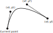
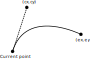
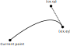
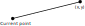
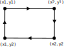

# Path

A path object represents vector graphics, as if drawn by a pen. They can
be used for stroking, filling or as a clip mask. The Path only determines
the shape, not properties such as color, line width or line joins, etc.

A path contains a sequence of zero or more subpaths, each subpath consists
of a sequence of zero or more basic operations which begins by a move to
point and ends with a close:

* move to point, append by calling [`Path.prototype.moveTo()`](#Path.prototype.moveTo)
* close subpath, append by calling [`Path.prototype.closePath()`](#Path.prototype.closePath)
* draw a straight line, append by calling [`Path.prototype.lineTo()`](#Path.prototype.lineTo)
* draw a cubic Bézier curve, append by calling either of [`Path.prototype.curveTo()`](#Path.prototype.curveTo),
  [`Path.prototype.curveToV()`](#Path.prototype.curveToV), or [`Path.prototype.curveToY()`](#Path.prototype.curveToY)
* draw a rectangle, append by calling [`Path.prototype.rect()`](#Path.prototype.rect), this is a subpath on
  its own and is equivalent to a move to a position, followed by drawing three
  lines and closing the subpath.

After a subpath is closed, the only operation that may be appended is a
move to point, in order to start a new subpath. This is a requirement to
ensure that an unclosed path always has a current point from which to
start basic drawing operations.

Once all desired operations have been appended to a Path, its bounds can
be determined, and it can be transformed. Finally, it’s possible to
iterate over the basic path operations via [`Path.prototype.walk()`](#Path.prototype.walk).

## Constructors

### *class* Path()

Create a new empty path.

```javascript
var path = new mupdf.Path()
```

## Instance methods

### Path.prototype.closePath()

Append operation closing the current subpath by drawing a straight
line to the point given in the last [`moveTo()`](PathWalker.md#moveTo). This also invalidates
the current point, but a new one may be set by calling [`moveTo()`](PathWalker.md#moveTo).

```javascript
path.closePath()
```

### Path.prototype.curveTo(x1, y1, x2, y2, x3, y3)

Append operation drawing a cubic Bézier curve from the current point
to (x3, y3) using (x1, y1) and (x2, y2) as control points.


* **Arguments:**
  * **x1** (`number`) – X1 coordinate.
  * **y1** (`number`) – Y1 coordinate.
  * **x2** (`number`) – X2 coordinate.
  * **y2** (`number`) – Y2 coordinate.
  * **x3** (`number`) – X3 coordinate.
  * **y3** (`number`) – Y3 coordinate.

```javascript
path.curveTo(0, 0, 10, 10, 100, 100)
```

### Path.prototype.curveToV(cx, cy, ex, ey)

Append operation drawing a cubic Bézier curve from the current point
to (ex, ey) using the current point and (cx, cy) as control points.
Will be converted to [`Path.prototype.curveTo()`](#Path.prototype.curveTo) when appended to this Path.


* **Arguments:**
  * **cx** (`number`) – CX coordinate.
  * **cy** (`number`) – CY coordinate.
  * **ex** (`number`) – EX coordinate.
  * **ey** (`number`) – EY coordinate.

```javascript
path.curveToV(0, 0, 100, 100)
```

### Path.prototype.curveToY(cx, cy, ex, ey)

Append operation drawing a cubic Bézier curve from the current point
to (ex, ey) using the (cx, cy) and (ex, ey) as control points. Will be
converted to [`Path.prototype.curveTo()`](#Path.prototype.curveTo) when appended to this Path.


* **Arguments:**
  * **cx** (`number`) – CX coordinate.
  * **cy** (`number`) – CY coordinate.
  * **ex** (`number`) – EX coordinate.
  * **ey** (`number`) – EY coordinate.

```javascript
path.curveToY(0, 0, 100, 100)
```

### Path.prototype.getBounds(strokeState, transform)

Return a bounding rectangle for the path.

Since the path does not describe properties such as line width, line
joins, etc., the caller must provide a `strokeState`, containing
those properties, to determine the bounds of path if it is stroked.

If no `strokeState` is provided, this call determines the bounds of
the path if it is filled.

`transform` is applied to the points in the path while computing the
bounds, but it is not applied to the points as stored in path, i.e.
the Path is not altered.

* **Arguments:**
  * **stroke** (`StrokeState | null`) – The stroking properties to use.
  * **transform** ([`Matrix`](Matrix.md#Matrix)) – A transform matrix applied to all points in path.
* **Returns:**
  [Rect](Rect.md)

```javascript
var rect = path.getBounds(strokeState, mupdf.Matrix.identity)
```

### Path.prototype.lineTo(x, y)

Append operation drawing a straight line from the current point to the
given point.


* **Arguments:**
  * **x** (`number`) – X coordinate.
  * **y** (`number`) – Y coordinate.

```javascript
path.lineTo(20, 20)
```

### Path.prototype.moveTo(x, y)

Append operation of lifting and moving the pen to the given point.
This begins a new subpath and sets the current point.

* **Arguments:**
  * **x** (`number`) – X coordinate.
  * **y** (`number`) – Y coordinate.

```javascript
path.moveTo(10, 10)
```

### Path.prototype.rect(x1, y1, x2, y2)

Shorthand for sequence:

```javascript
moveTo(x1, y1)
lineTo(x2, y1)
lineTo(x2, y2)
lineto(x1, y2)
closePath()
```


* **Arguments:**
  * **x1** (`number`) – X1 coordinate.
  * **y1** (`number`) – Y1 coordinate.
  * **x2** (`number`) – X2 coordinate.
  * **y2** (`number`) – Y2 coordinate.

```javascript
path.rect(0, 0, 100, 100)
```

### Path.prototype.transform(matrix)

Transform the path by applying the given transformation matrix.

This is done by transforming each point in all of the paths’ basic
drawing operations.

* **Arguments:**
  * **matrix** ([`Matrix`](Matrix.md#Matrix)) – Transformation matrix to apply.

```javascript
path.transform(mupdf.Matrix.scale(2, 2))
```

### Path.prototype.walk(walker)

Iterate over all the basic drawing operations in this Path, calling
a corresponding callback in the walker object passing the coordinates
stored with the drawing operation.

* **Arguments:**
  * **walker** ([`PathWalker`](PathWalker.md#PathWalker)) – Object with callback functions.

```javascript
function print(...args) {
        console.log(args.join(" "))
}

var pathPrinter = {
        moveTo: function (x, y) { print("moveTo", x, y) },
        lineTo: function (x, y) { print("lineTo", x, y) },
        curveTo: function (x1, y1, x2, y2, x3, y3) { print("curveTo", x1, y1, x2, y2, x3, y3) },
        closePath: function () { print("closePath") },
}

var traceDevice = {
        fillPath: function (path, evenOdd, ctm, colorSpace, color, alpha) {
                print("fillPath", evenOdd, ctm, colorSpace, color, alpha)
                path.walk(pathPrinter)
        },
        clipPath: function (path, evenOdd, ctm) {
                print("clipPath", evenOdd, ctm)
                path.walk(pathPrinter)
        },
        strokePath: function (path, stroke, ctm, colorSpace, color, alpha) {
                print("strokePath", JSON.stringify(stroke), ctm, colorSpace, color, alpha)
                path.walk(pathPrinter)
        },
        clipStrokePath: function (path, stroke, ctm) {
                print("clipStrokePath", JSON.stringify(stroke), ctm)
                path.walk(pathPrinter)
        }
}

var doc = mupdf.Document.openDocument(fs.readFileSync("test.pdf"), "application/pdf")
var page = doc.loadPage(0)
var device = new mupdf.Device(traceDevice)
page.run(device, mupdf.Matrix.identity)
```
